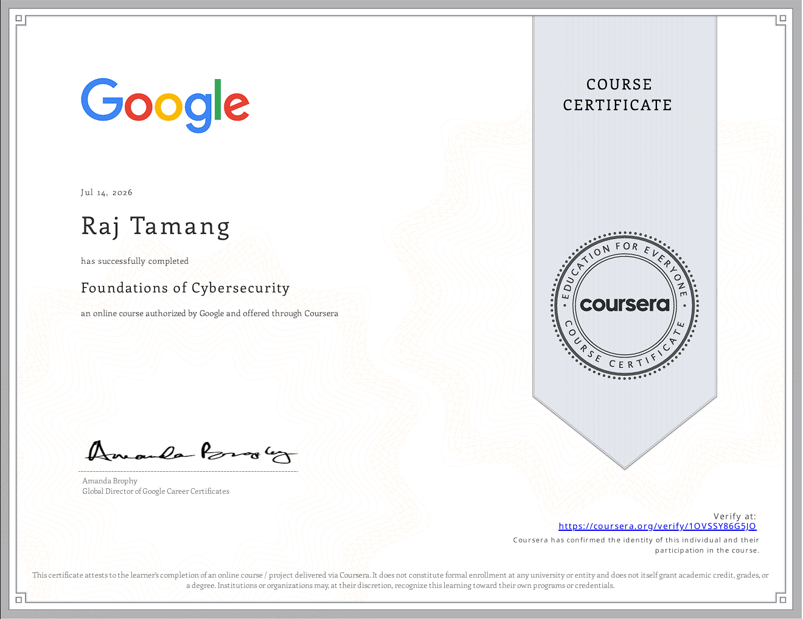

# Google Cybersecurity Professional Certificate

# Course 1: Foundations of Cybersecurity


---

## 📖 Overview

This repository documents my learning journey through **Course 1: Foundations of Cybersecurity** from the **Google Cybersecurity Professional Certificate** offered by Google on Coursera.

Throughout this course, I built a strong foundation in cybersecurity by learning about cyber threats, security frameworks, ethical principles, risk management, essential security tools, and the programming technologies commonly used by cybersecurity professionals.

---

## 🎯 Skills Gained

- Cybersecurity Fundamentals
- Cyber Threat Analysis
- Risk Management
- Security Controls
- Security Frameworks
- Ethics in Cybersecurity
- Linux Fundamentals
- SQL Fundamentals
- Python Fundamentals
- Security Monitoring
- Professional Documentation
- Cybersecurity Portfolio Development

---

# 📚 Course Modules

| Module | Topic | Status |
|---------|-------|--------|
| ✅ Module 1 | Welcome to the Exciting World of Cybersecurity | Completed |
| ✅ Module 2 | The Evolution of Cybersecurity | Completed |
| ✅ Module 3 | Protect Against Threats, Risks, and Vulnerabilities | Completed |
| ✅ Module 4 | Cybersecurity Tools and Programming Languages | Completed |

---

# 📂 Repository Structure

```
Course-1-Foundations-of-Cybersecurity/
│
├── README.md
│
├── certificate/
│   └── course-1-certificate.png
│
├── Module-1/
│
├── Module-2/
│
├── Module-3/
│
├── Module-4/
```

---

# 🏆 Certificate

> Successfully completed **Course 1: Foundations of Cybersecurity** from the **Google Cybersecurity Professional Certificate**.

### 📜 Course Certificate



---

# 📝 Course Summary

During this course, I learned how cybersecurity professionals protect organizations, systems, and sensitive data from cyber threats.

Key topics included:

- Cybersecurity fundamentals
- History of cyber attacks
- Common cyber threats
- Threat actors
- Risk management
- Security frameworks (NIST, CIS Controls, ISO/IEC 27001)
- Security controls
- Ethics in cybersecurity
- Linux basics
- SQL basics
- Python basics
- SIEM, IDS, IPS, and EDR tools
- Building a cybersecurity portfolio

---

# 🛠 Tools & Technologies

- Linux
- SQL
- Python
- SIEM
- IDS
- IPS
- EDR
- Git
- GitHub

---

# 🎯 My Goal

I am currently completing the **Google Cybersecurity Professional Certificate** to build practical cybersecurity skills and prepare for roles such as:

- Cybersecurity Analyst
- SOC Analyst
- Security Engineer
- Incident Responder
- Ethical Hacker
- Penetration Tester

---

# 🚀 Next Course

**Course 2: Play It Safe – Manage Security Risks**

Topics include:

- Security Governance
- Risk Assessment
- Compliance
- Security Audits
- Risk Management
- Asset Security

---

# 🙏 Acknowledgements

- Google
- Coursera
- Google Cybersecurity Professional Certificate Team

---

# 📄 License

This repository is for educational purposes only.

---

> *"The strongest defense starts with a solid foundation."*